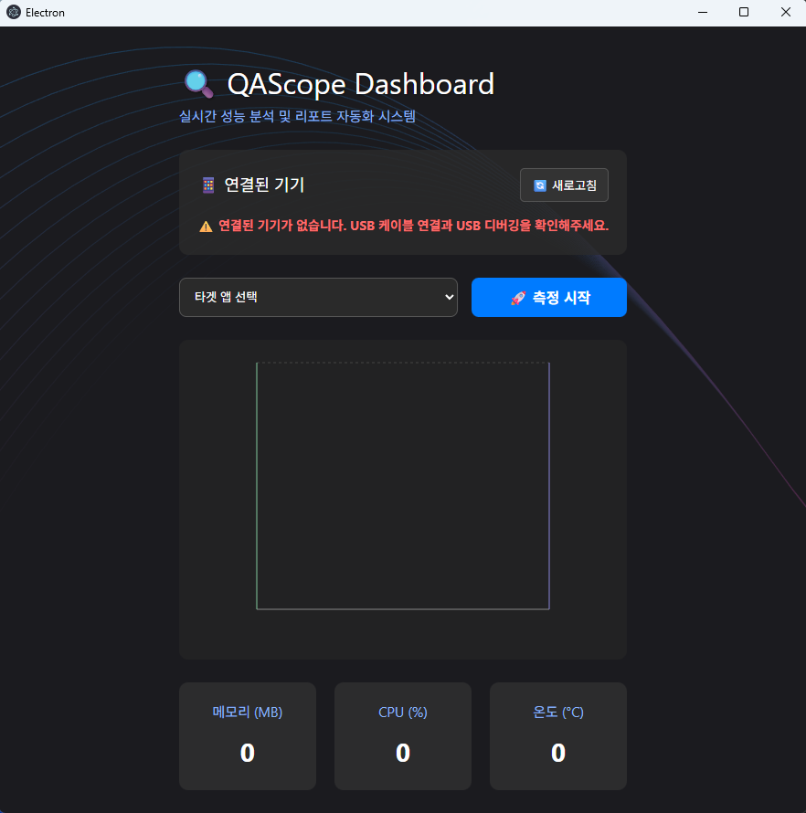
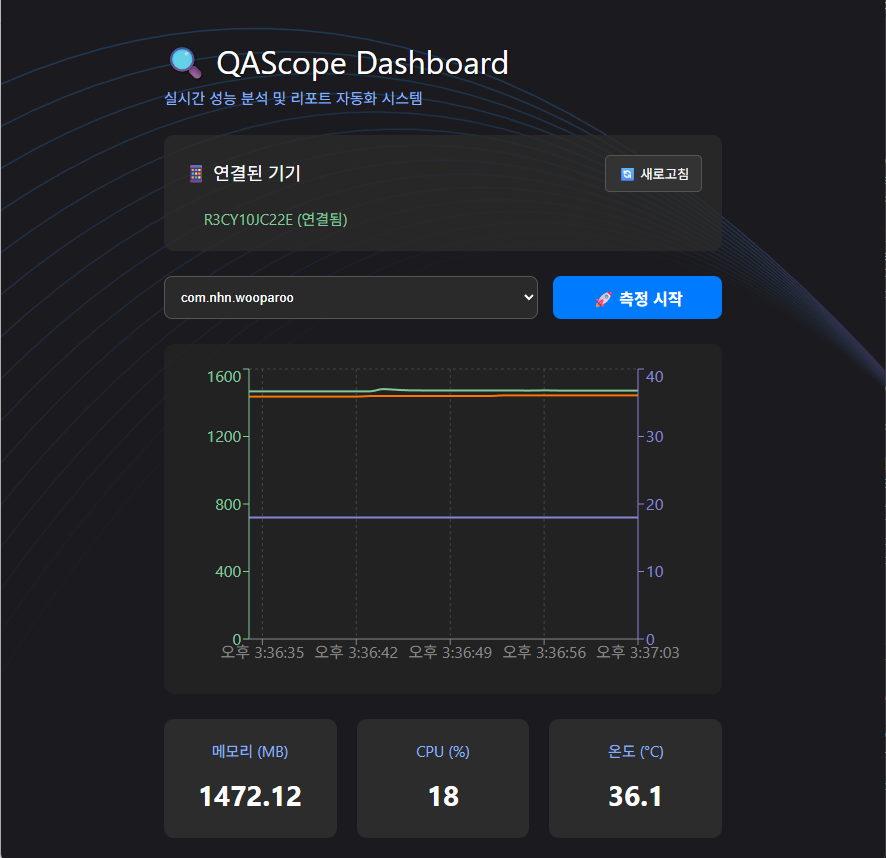
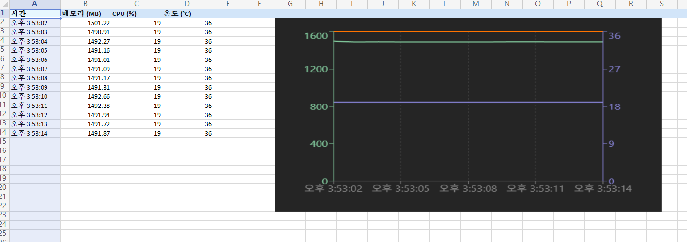

# 🔍 QAScope (QA Performance Scope)


- `QAScope`는 안드로이드 애플리케이션의 핵심 리소스(Memory, CPU, Battery Temperature)를 실시간으로 추적하고 시각화하며 원클릭으로 엑셀 리포트를 자동 생성해 주는 데스크톱 QA 자동화 프로파일링 툴입니다.

## 🚀 제작 배경 및 목적
- 안드로이드 앱, 특히 무거운 리소스를 사용하는 타겟 앱을 테스트할 때 매번 터미널을 열어 명령어를 입력하고 데이터를 수동으로 기록하는 과정은 매우 소모적입니다. 
- 이러한 반복 작업을 자동화하고, 직관적인 시각화 및 문서화까지 한 번에 처리하여 테스트 효율을 극대화하기 위해 개발했습니다.

## ✨ 주요 기능
- 📱 자동화된 디바이스/앱 연동: ADB(Android Debug Bridge)를 통해 연결된 기기와 서드파티 패키지 목록을 자동으로 불러옵니다.

- 📊 실시간 성능 모니터링: 선택한 타겟 앱의 메모리 사용량(MB), CPU 점유율(%), 배터리 온도(°C)를 1초 단위로 측정하여 대시보드에 렌더링합니다.

- 📈 이중 Y축(Dual Y-Axis) 시각화: 스케일이 다른 데이터(수천 단위의 메모리 vs 100 이하의 CPU/온도)를 한 차트에서 왜곡 없이 비교 분석할 수 있습니다.

- 📑 원클릭 엑셀 리포트 자동화: 측정 중단 시, 누적된 1초 단위의 Raw 데이터와 현재 차트의 스냅샷 이미지를 포함한 .xlsx 리포트를 즉시 생성합니다.





## 🛠 Tech Stack
- Frontend: React, TypeScript, Vite, Recharts (데이터 시각화), html2canvas (DOM 캡처)

- Backend: Electron (Node.js 기반 IPC 통신 및 OS Native 기능 제어)

- Document Automation: ExcelJS

- Dev Tools: ADB (Android Debug Bridge)

## 💡 Trouble Shooting (핵심 문제 해결 과정)
#### 1. 다중 프로세스(게임 엔진 등) 앱의 메모리 측정 불가 문제
- 문제: 단순 패키지명(com.example.app)으로 dumpsys meminfo를 요청할 경우 다중 프로세스를 띄우는 무거운 앱에서는 시스템이 타겟을 찾지 못해 메모리 값이 0으로 반환되는 현상 발생.

- 해결: `adb shell pidof [패키지명]` 명령어를 선행하여 실제 동작 중인 PID(프로세스 ID) 목록을 추출하고, 메인 프로세스(첫 번째 PID)를 타겟으로 락온(Lock-on)하여 정밀하게 메모리를 덤프하도록 백엔드 로직 전면 개편.

- 추가 개선: 안드로이드 OS 버전 파편화에 대응하기 위해 구형(`TOTAL:`)과 신형(`TOTAL PSS:`) 출력 포맷을 모두 파싱할 수 있는 하이브리드 정규식(`/(?:TOTAL PSS:|TOTAL:)\s+(\d+)/i`) 적용.

#### 2. 비동기 병렬 처리를 통한 측정 지연(Latency) 해결
- 문제: 메모리, CPU, 온도 3가지의 덤프 명령어를 직렬(순차적)로 실행할 경우, 총 응답 시간이 길어져 '1초 단위 실시간 렌더링'이라는 요구사항을 충족하지 못함.

- 해결: Node.js의 `Promise.all`을 활용하여 3개의 무거운 I/O 명령어를 독립적인 병렬 트랙에서 동시 실행. 가장 오래 걸리는 작업의 시간 내에 모든 데이터 수집을 완료하여 UI 프레임 드랍 없이 쾌적한 1초 주기를 보장.

#### 3. 보고서 자동화 시 시각적 직관성 한계 극복
- 문제: Raw 데이터(숫자)만 엑셀로 추출할 경우, 성능의 트렌드(스파이크 등)를 한눈에 파악하기 어려움.

- 해결: html2canvas 라이브러리를 도입. 프론트엔드에 렌더링된 Recharts DOM 요소를 캡처하여 Base64 이미지로 인코딩한 뒤, IPC 통신을 통해 백엔드로 전달. 백엔드에서는 ExcelJS를 활용해 데이터 시트 우측(G1 셀)에 해당 스냅샷을 동적으로 부착하여 완벽한 형태의 시각화 리포트 완성.

## 💻 설치 및 실행 방법
### 사전 준비 사항

- Node.js (v18 이상 권장)

- Android SDK Platform-Tools (ADB 환경 변수 설정 필수)

- USB 디버깅이 활성화된 안드로이드 디바이스

## 설치 및 실행

```Bash
# 저장소 클론
git clone [자신의 깃허브 레포지토리 주소]

# 폴더 이동
cd QAScope

# 패키지 설치
npm install

# 개발 서버 실행
npm run dev
빌드 (실행 파일 생성)
```

```bash
npm run build:win
```
- 빌드 완료 후 dist 폴더 내에 .exe 설치 파일이 생성됩니다.